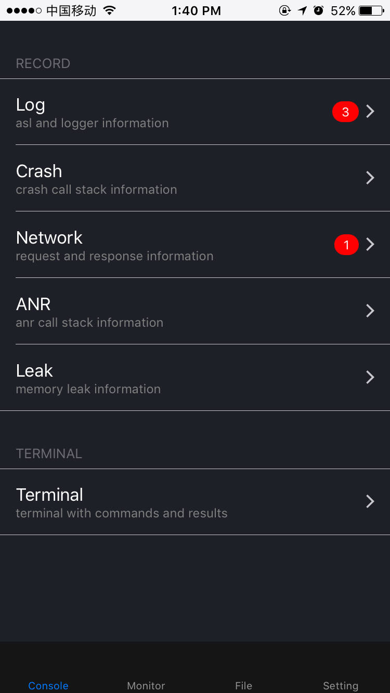
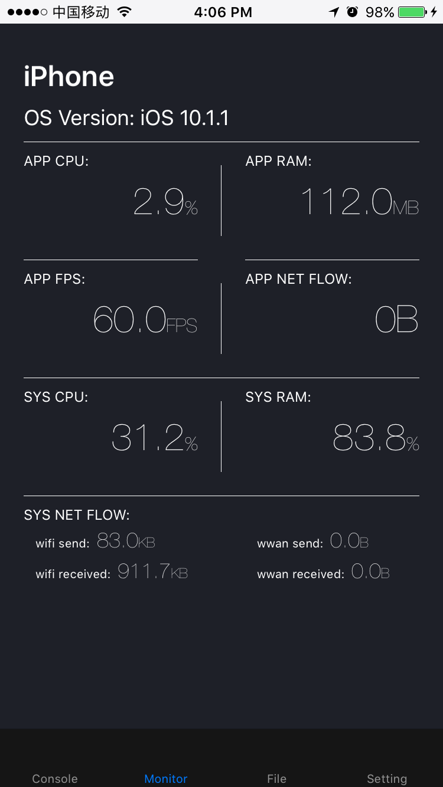
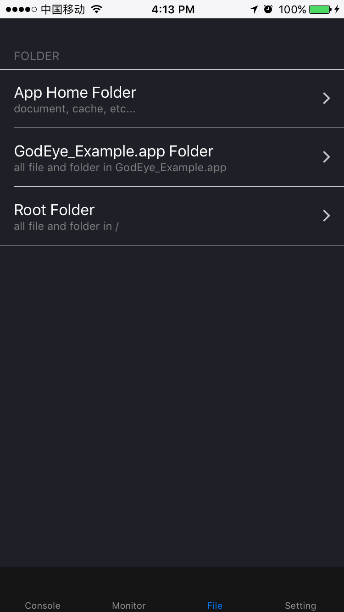
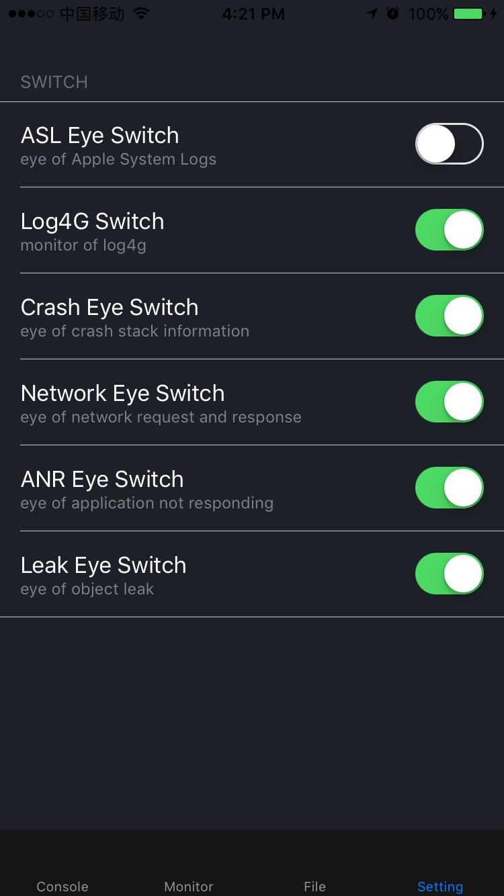
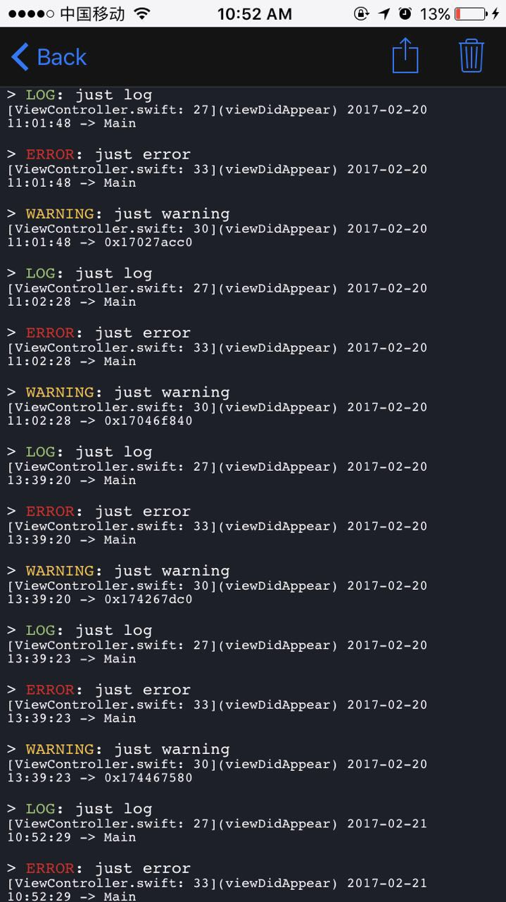
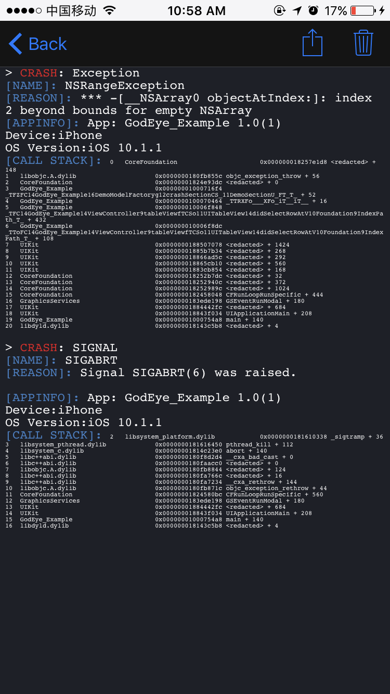
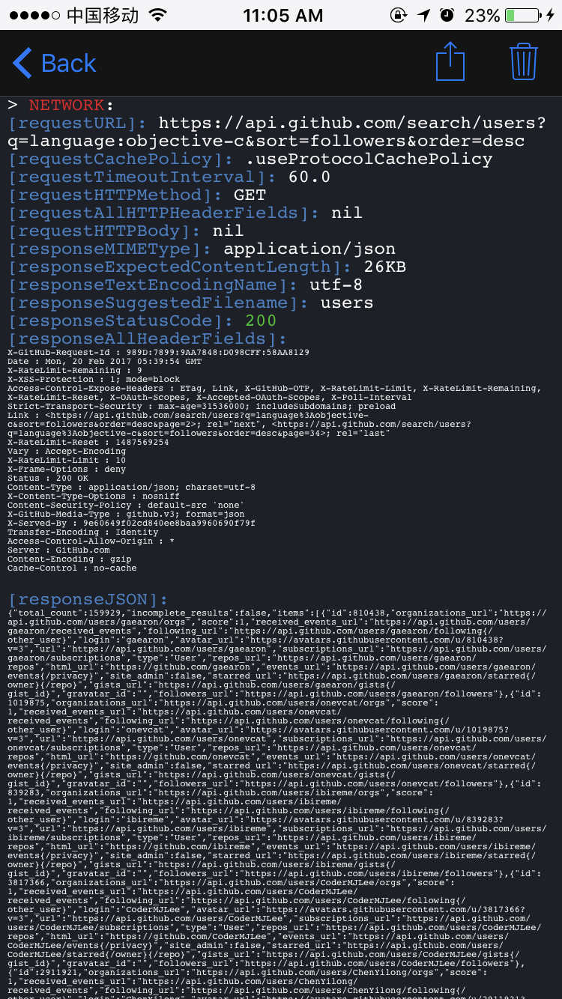
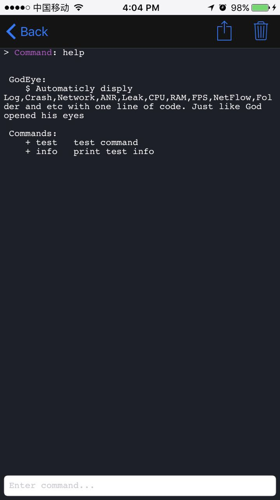
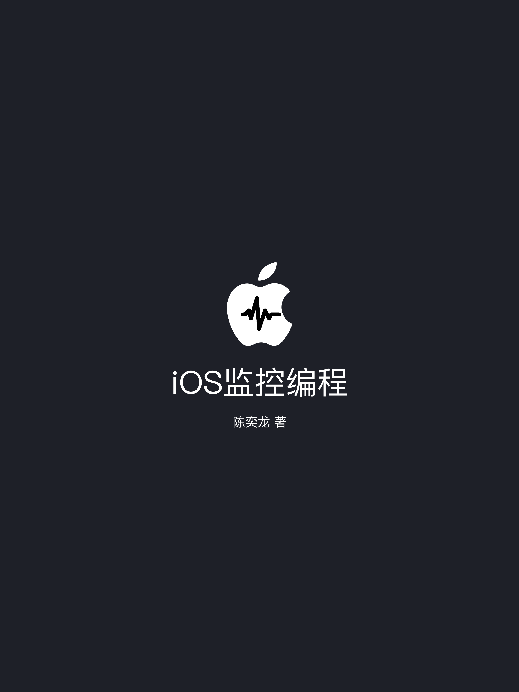

<p align="center">
  
</p>

# GodEye

[](http://cocoapods.org/pods/GodEye)
[](http://cocoapods.org/pods/GodEye)
[](http://cocoapods.org/pods/GodEye)

Automaticly display Log,Crash,Network,ANR,Leak,CPU,RAM,FPS,NetFlow,Folder and etc with one line of code based on Swift. Just like God opened his eyes.

**[中文文档](./README_CN.md)**

It's so huge that I split it into several independent components:

* [Log4G](https://github.com/zixun/Log4G) — Simple, lightweight logging framework written in Swift.
* [AssistiveButton](https://github.com/zixun/AssistiveButton) — Simple Assistive Button.
* [AppBaseKit](https://github.com/zixun/AppBaseKit) — A handy kit of Swift extensions and wrapped class to boost your productivity.
* [AppSwizzle](https://github.com/zixun/AppSwizzle) — lightweight and flexible method swizzling wrapped by swift.
* [LeakEye](https://github.com/zixun/LeakEye) — LeakEye is a memory leak monitor.
* [NetworkEye](https://github.com/zixun/NetworkEye) — NetworkEye is a network monitor,automatic catch the request and response infomation of all kinds of request send.
* [ANREye](https://github.com/zixun/ANREye) — ANREye is an ANR (Application Not Responding) monitor,automatic catch the ANR and return stacktrace of all threads.
* [ASLEye](https://github.com/zixun/ASLEye) — ASLEye is an ASL(Apple System Log) monitor, automatic catch the log from NSLog by asl module.
* [CrashEye](https://github.com/zixun/CrashEye) — CrashEye is an ios crash monitor，automatic catch exception crash & signal crash and return the stacktrace.
* [SystemEye](https://github.com/zixun/SystemEye) — SystemEye is a system monitor,automatic catch the infomation of cpu,memory....etc.

## Features

- [x] monitor for the log and point out log type.
- [x] monitor for the crash, include Uncatched Exception and Signal.
- [x] monitor for the network, all information of request and response.
- [x] monitor for the ANR, tell you the stacktrace of all threads.
- [x] monitor for the memory leak, tell you the leak object's class name.
- [x] a terminal for you to customized your commands and things what to do.
- [x] monitor for the cpu usage of system and application.
- [x] monitor for the ram usage of system and application.
- [x] monitor for the FPS.
- [x] monitor for the netflow of system and application. 
- [x] a file browser for look through the sandbox, .app and root directory.
- [x] custom and runtime setting

## Characteristics

- [x] richly: comprehensive feature
- [x] conveniently: one line code access
- [x] automaticly: no code intrusion
- [x] safety: no compile code in release


## Preview
  
  
  
  
  
  
  
  
  

## Installation

GodEye is available through [CocoaPods](http://cocoapods.org). To install
it, simply add the following line to your Podfile:

```ruby
pod "GodEye"
```

## Book and Principle

**I has wrote a book named [《iOS监控编程》](https://www.qingdan.us/product/25),each chapter records the course function of the implementation details and the way to explore.sorry for english friends,this book wrote by chineses.**

<p align="center">
  
</p>

## OpenSource Application Use GodEye

[CocoaChinaPlus](https://github.com/zixun/CocoaChinaPlus) is an open source application wrote by swift, now the GodEye is work well in it!

## Usage

import at AppDelegate:

```swift
import GodEye
```

making GodEye at `application:didFinishLaunchingWithOptions`:

```ruby
GodEye.makeEye(with:self.window!)
```

well, make GodEye with one line code as above will use default configuration.We also can custom our configuration:

```swift
let configuration = Configuration()
configuration.command.add(command: "test", description: "test command") { () -> (String) in
    return "this is test command result"
}
configuration.command.add(command: "info", description: "print test info") { () -> (String) in
    return "info"
}
    
GodEye.makeEye(with: self.window!, configuration: configuration)
```

the example above is custom command configuration, we also can custom control and switch configuration.see detail at `ControlConfiguration` and `SwitchConfiguration`


## Example

To run the example project, clone the repo, and run `pod install` from the Example directory first.

## Author

twitter: [@zixun_](https://twitter.com/zixun_)

email: chenyl.exe@gmail.com

github: [zixun](https://github.com/zixun)

blog: [子循(SubCycle)](http://zixun.github.io/)

## Thanks
First is Github, it gives me a lot of ideas and inspiration, and even ready-made code:

* Log monitor inspired by [AELog](https://github.com/tadija/AELog)
* Crash monitor inspired by [GT](https://github.com/Tencent/GT)
* ANR monitor inspired by [Watchdog](https://github.com/wojteklu/Watchdog)
* Network monitor inspired by [NetworkEye](https://github.com/coderyi/NetworkEye)

Secondly is StackOverFlow, it answers a lot of problems encountered in the author's writing and development,here are a few images of deep:

* CPU usage of application:[ios-get-cpu-usage-from-application](https://stackoverflow.com/questions/8223348/ios-get-cpu-usage-from-application)
* CPU usage of system:[get-cpu-percent-usage](https://stackoverflow.com/questions/6785069/get-cpu-percent-usage)

Finally, thanks to several great blog:

* Memory Leak inspired by MrPeak's PLeakSniffer: [http://mrpeak.cn/blog/leak](http://mrpeak.cn/blog/leak)
* wereadteam's MLeaksFinder: [https://wereadteam.github.io/2016/02/22/MLeaksFinder](https://wereadteam.github.io/2016/02/22/MLeaksFinder)

## License

GodEye is available under the MIT license. See the LICENSE file for more info.


