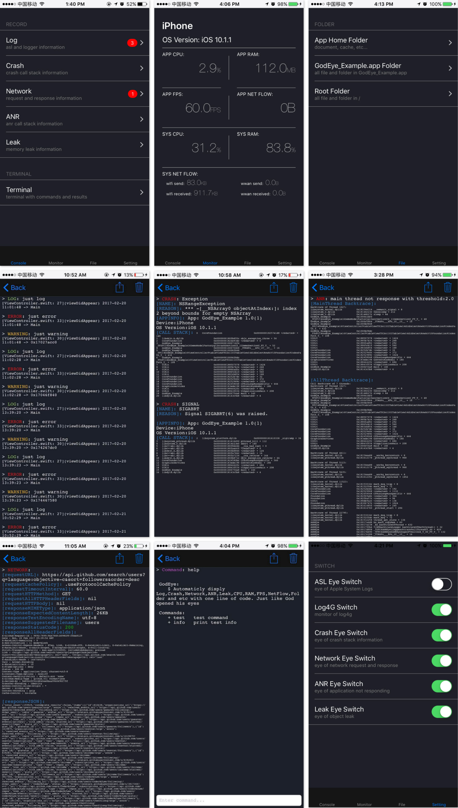
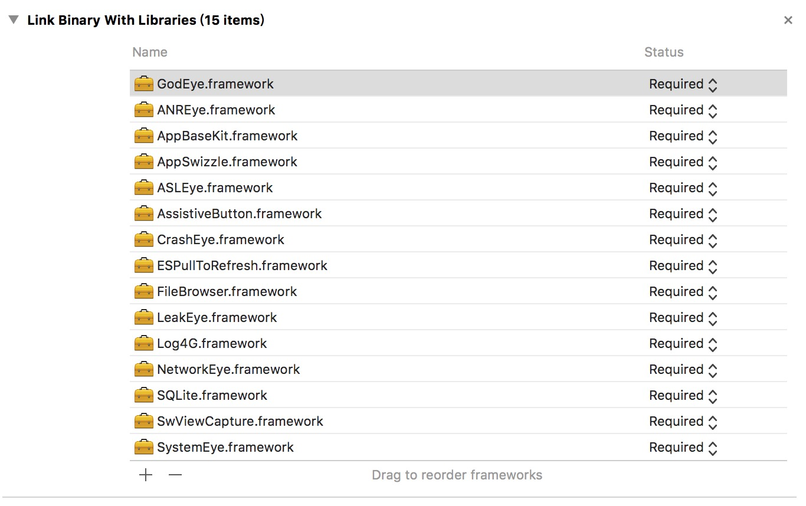
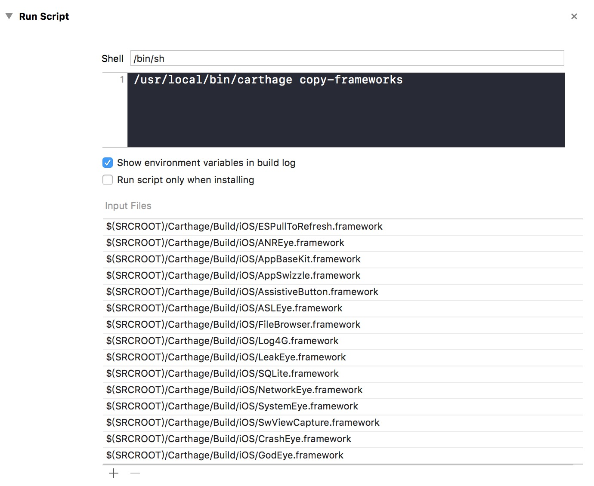

<p align="center">
  
</p>

# GodEye

[](http://cocoapods.org/pods/GodEye)
[](http://cocoapods.org/pods/GodEye)
[](http://cocoapods.org/pods/GodEye)
[](https://github.com/Carthage/Carthage)

Automaticly display Log,Crash,Network,ANR,Leak,CPU,RAM,FPS,NetFlow,Folder and etc with one line of code based on Swift. Just like God opened his eyes.

**[ENGLISH README](./README.md)**

为了尽量复用代码，这个项目中的某些组件之间有比较强的依赖关系。为了方便其他开发者使用，我从中拆分出以下独立组件:

* [Log4G](https://github.com/zixun/Log4G) — Simple, lightweight logging framework written in Swift.
* [AssistiveButton](https://github.com/zixun/AssistiveButton) — Simple Assistive Button.
* [AppBaseKit](https://github.com/zixun/AppBaseKit) — A handy kit of Swift extensions and wrapped class to boost your productivity.
* [AppSwizzle](https://github.com/zixun/AppSwizzle) — lightweight and flexible method swizzling wrapped by swift.
* [LeakEye](https://github.com/zixun/LeakEye) — LeakEye is a memory leak monitor.
* [NetworkEye](https://github.com/zixun/NetworkEye) — NetworkEye is a network monitor,automatic catch the request and response infomation of all kinds of request send.
* [ANREye](https://github.com/zixun/ANREye) — ANREye is an ANR (Application Not Responding) monitor,automatic catch the ANR and return stacktrace of all threads.
* [ASLEye](https://github.com/zixun/ASLEye) — ASLEye is an ASL(Apple System Log) monitor, automatic catch the log from NSLog by asl module.
* [CrashEye](https://github.com/zixun/CrashEye) — CrashEye is an ios crash monitor，automatic catch exception crash & signal crash and return the stacktrace.
* [SystemEye](https://github.com/zixun/SystemEye) — SystemEye is a system monitor,automatic catch the infomation of cpu,memory....etc.

## 功能

- [x] 监控日志并区分日志类型.
- [x] 监控崩溃, 包括Uncatched Exception和Signal崩溃.
- [x] 监控网络, 包括请求和响应的所有信息.
- [x] 监控卡顿, 并告诉你卡顿时候的所有线程的堆栈.
- [x] 监控内存泄露, 告诉你泄露的对象的类名.
- [x] 提供一个可以自定义指令和输出的控制台.
- [x] 监控系统和应用自身的CPU使用率.
- [x] 监控系统与应用自身的内存使用率.
- [x] 监控帧率FPS.
- [x] 监控系统和应用自身的网络流量. 
- [x] 提供一个文件浏览器可用于查看沙盒，.app 以及系统根目录的文件.
- [x] 运行时自定义设置

## 特点

- [x] 丰富: 功能全面
- [x] 方便: 一行代码接入
- [x] 自动: 零代码入侵
- [x] 安全: Release包可不打入一行代码


## 预览
  

## 书与原理

**笔者写了一本书，名叫[《iOS监控编程》](https://www.qingdan.us/product/25),每个章节记录了功能的实现细节，以及笔者一路探索的心路历程。当然，笔者后续依旧会寻求与探索新的监控方向，一旦有所得都会更新到本书的章节中.**

<p align="center">
  
</p>

## 安装
### CocoaPods
GodEye目前可以通过 [CocoaPods](http://cocoapods.org)来安装.只需要将下面的代码加入到你的Podfile中即可:

```ruby
pod "GodEye"
```

#### 在Release下不编译进一行代码
首先，在Podfile中添加configurations配置：

```ruby
pod 'GodEye', '~> 1.0.0', :configurations => ['Debug']
```

然后，在你的target的`Build Settings`中找到`Other Swift Flags`项，,在Debug scheme中添加 `DEBUG`.

最后，在初始化GodEye代码上添加`DEBUG`宏：

```swift
#if DEBUG 
    GodEye.makeEye(with: self.window!)
#endif
```

### Carthage
如果你使用 [Carthage](https://github.com/Carthage/Carthage)来集成, 在Cartfile添加GodEye:

``` 
github "zixun/GodEye"
```

#### Add GodEye to Embed Frameworks
拖拽Carthage/Build目录下的`GodEye.framework`到你应用的target的`“General”`设置面板中的`“Embed Frameworks”`栏中

#### Add Dependency to Linked Frameworks and Libraries

拖拽Carthage/Build目录下的GodEye依赖的framework到你应用的target的`“General”`设置面板中的`“Linked Frameworks and Libraries”`栏中

<p align="center">
  
</p>

#### Add Run Script
在你应用的target下的“Build Phases”设置面板中，点击“+”按钮，选择“New Run Script Phase”，新建一个Run Script，添加下面的内容到shell输入框中：

```
/usr/local/bin/carthage copy-frameworks
```

添加上面依赖的framework的路径到“Input Files”中：

<p align="center">
  
</p>

## 在使用GodEye的开源App

[CocoaChinaPlus](https://github.com/zixun/CocoaChinaPlus)是一款用Swift编写的开源的CocoaChina第三方客户端，目前已经接入GodEye，并且可以很好的工作。


## 使用

在`AppDelegate`中用下面的代码导入进来:

```swift
import GodEye
```

然后在 `application:didFinishLaunchingWithOptions`初始化GodEye:

```ruby
GodEye.makeEye(with:self.window!)
```

当然，一行代码接入是一种默认配置的接入，读者也可以通过传入自己的`Configuration`来精细化配置各个细节:

```swift
let configuration = Configuration()
configuration.command.add(command: "test", description: "test command") { () -> (String) in
    return "this is test command result"
}
configuration.command.add(command: "info", description: "print test info") { () -> (String) in
    return "info"
}
    
GodEye.makeEye(with: self.window!, configuration: configuration)
```
上面的示例是自定义命令的配置，我们也可以自定义`control`和`switch`的配置，详细的配置项可以看`ControlConfiguration` 和 `SwitchConfiguration`两个类。


## 示例
clone这个库，在Example目录下运行`pod install`就可以跑工程自带的示例工程了。

## 作者

twitter: [@zixun_](https://twitter.com/zixun_)

email: chenyl.exe@gmail.com

github: [zixun](https://github.com/zixun)

blog: [子循(SubCycle)](http://zixun.github.io/)

## 感谢
首先需要感谢的是开源社区Github，它给了我很多思路和灵感，甚至现成的代码：

* 日志监控灵感源于AELog:[https://github.com/tadija/AELog](https://github.com/tadija/AELog)；
* 崩溃监控灵感源于GT:[https://github.com/Tencent/GT](https://github.com/Tencent/GT);
* 卡顿监控灵感源于Watchdog:[https://github.com/wojteklu/Watchdog](https://github.com/wojteklu/Watchdog)；
* 网络监控灵感源于NetworkEye:[https://github.com/coderyi/NetworkEye](https://github.com/coderyi/NetworkEye)；

其次要感谢的是全球最大的技术问答社区StackOverFlow，它解答了笔者写作与开发中很多遇到的问题,以下列出几个映象深刻的：

* 应用的CPU使用率：[ios-get-cpu-usage-from-application](https://stackoverflow.com/questions/8223348/ios-get-cpu-usage-from-application)；
* 系统的CPU使用率: [get-cpu-percent-usage](https://stackoverflow.com/questions/6785069/get-cpu-percent-usage)

然后要感谢的是几位大牛的博客：

* 内存泄漏灵感源于MrPeak的PLeakSniffer:[http://mrpeak.cn/blog/leak](http://mrpeak.cn/blog/leak)
* 微信阅读团队MLeaksFinder：[https://wereadteam.github.io/2016/02/22/MLeaksFinder](https://wereadteam.github.io/2016/02/22/MLeaksFinder)

## 开源协议
GodEye开源在 MIT 协议下，详细请查看 LICENSE 文件。


